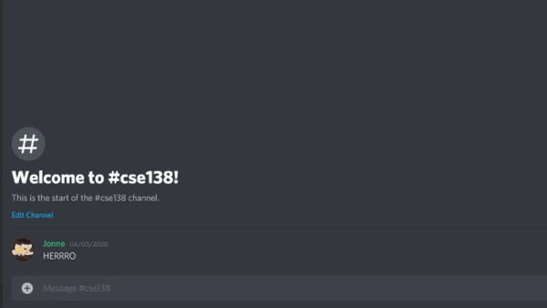

# PiazzaBot
Discord bot to embed Piazza posts in the server

## About


PiazzaBot will give you a embeded preview of a Piazza post right on your server!
Just enter in the link to the post, and PiazzaBot will take care of the rest! 

## Installation
To run PiazzaBot locally, do the following: 

1. First make a virtual environment in python using

```
python3 -m venv ./env
source ./env/bin/activate
pip3 install -r requirements
```

2. Export your environment variables as such
```
export EMAIL='{your email here}'
export PASSWORD='{your password here}`
```
3. Then run the program with `python3 ./connect.py`

NOTE: Your Piazza account must be enrolled in the class to get the embeded preview, or else
it won't work.

## Deployment
This current repository is connected & deployed using Heroku. Any commits to the master branch
will automatically be deployed.

## Built With
- Python
- [Piazza API](https://github.com/hfaran/piazza-api)
- [discord.py](https://github.com/Rapptz/discord.py)

## Contributors
- [Zachary Zulanas](https://github.com/zzulanas)
- [Gico Carlo Evangelsita](https://github.com/RiceAbove)

## License
This project is licensed under [MIT](LICENSE) - see the LICENSE file for details